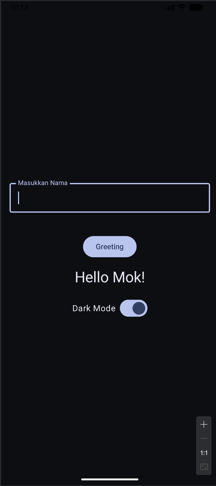
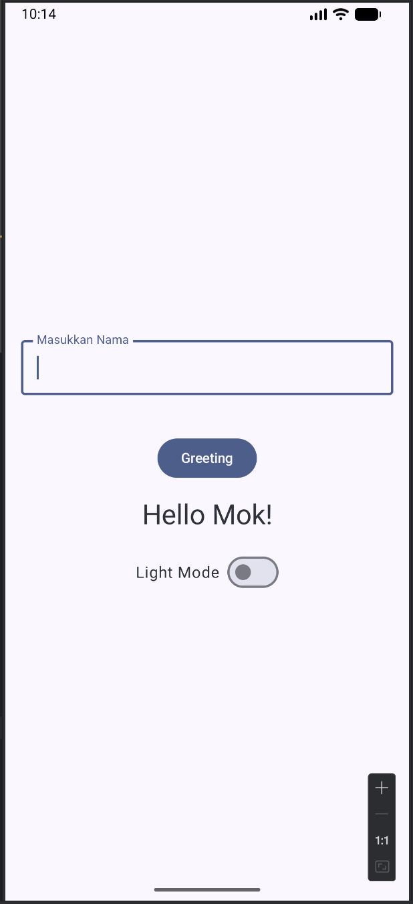
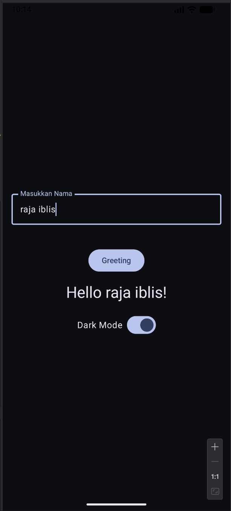
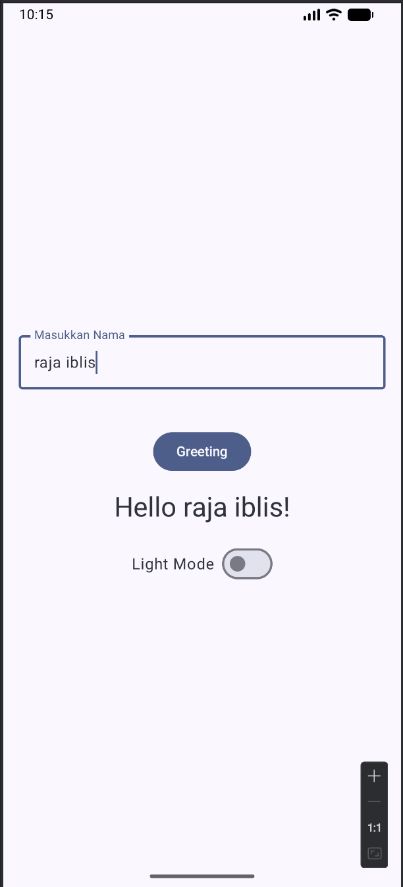

# HelloUI-PemrogramanMobile
## Tugas 1 Pemrograman Mobile 
Nama : Muhammad Dzul Fathi Ahyan <br>
NIM  : 2410817210011 <br>
### Deskripsi  
Aplikasi ini merupakan aplikasi dengan menggunakan bahasa pemrograman kotlin yang dilengkapi dengan fitur input nama dan akan menghasilkan output berupa "Hello, nama!" yang juga dilengkapi mode gelap dan terang<br>
### Cara Menjalankan
Cara Menjalankan : 
1. Clone repository ini menggunakan terminal atau CMD
   ```
   git clone [https://github.com/ZulFath1/Hello-Ui.git]
3. Buka folder repository yang telah diclone dengan Android Studio
4. Tunggu proses Gradle Sync selesai.
5. Lakukan klik Run pada bagian atas atau menggunakan tombol Shift+F10
6. Aplikasi berhasil dijalankan menggunakan emulator bawaan dari Android Studio <br>

### Gambar

<p align="center">
  
  
  
  
</p>
